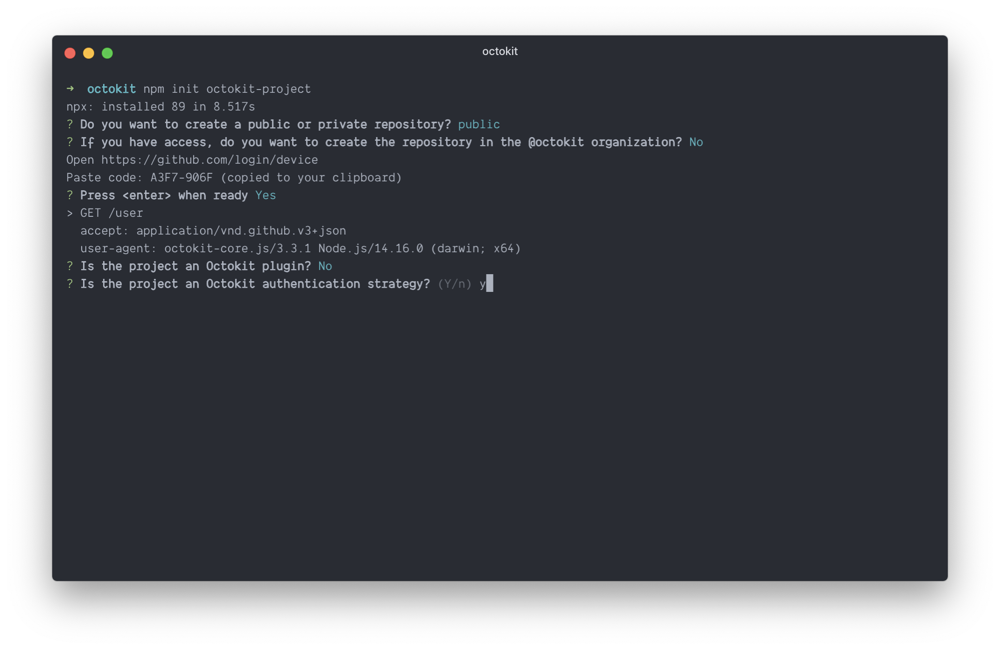

# authentication-strategies.js

> GitHub API authentication strategies for Browsers, Node.js, and Deno

<!-- toc -->

- [Official Authentication Strategies](#official-authentication-strategies)
  - [Personal Access Token authentication](#personal-access-token-authentication)
  - [GitHub App or installation authentication](#github-app-or-installation-authentication)
  - [OAuth app authentication](#oauth-app-authentication)
  - [OAuth user authentication](#oauth-user-authentication)
  - [OAuth user client authentication](#oauth-user-client-authentication)
  - [Device authentication](#device-authentication)
  - [GitHub Action authentication](#github-action-authentication)
- [Other Strategies](#other-strategies)
  - [unauthenticated](#unauthenticated)
  - [callback](#callback)
  - [.netrc](#netrc)
- [How authentication strategies work](#how-authentication-strategies-work)
  - [`authenticationStrategy(strategyOptions)`](#authenticationstrategystrategyoptions)
  - [`auth` interface](#auth-interface)
  - [The `authOptions.factory` pattern](#the-authoptionsfactory-pattern)
- [Create your own Octokit authentication strategy module](#create-your-own-octokit-authentication-strategy-module)
- [License](#license)

<!-- tocstop -->

## Official Authentication Strategies

### Personal Access Token authentication

**Module**: [`@octokit/auth-token`](https://github.com/octokit/auth-token.js#readme)

The simplest authentication strategy requires a user to create a personal access token at https://github.com/settings/tokens/new and pass it as the single argument to the `createTokenAuth()` function. You can pass in any other token such as an installation access token or a OAuth user access token, but there are dedicated strategies for the respective use cases which might be a better fit.

`@octokit/auth-token` is the default authentication strategy built into [`@octokit/core`](https://github.com/octokit/core.js/#authentication)

```js
const auth = createTokenAuth("1234567890abcdef1234567890abcdef12345678");
const { token } = await auth();
```

### GitHub App or installation authentication

**Module**: [`@octokit/auth-app`](https://github.com/octokit/auth-app.js#readme)
**SDK**: [`@octokit/app`](https://github.com/octokit/app.js#readme)

A GitHub app has four different means of authentication.

1. **It can authenticate as itself** using a JWT (JSON Web Token) derived from the app ID and a private key. JWT authentication is required to iterate through installations and repositories, use the marketplace APIs, or to create installation access tokens.
2. **It can authenticate as an installation** using an installation access tokens. GitHub apps can be actors like GitHub users. They can create issues, manage teams, and much more. Installing a GitHub app grants access to a GitHub user account or organization, and either all or selected repositories. The installation inherits the app's permissions at this point, they will not be altered if the app's permissions change until the user/organization account owner accepts the new permissions. Installation access tokens expire after 1h, and they can be created with a subset of the installations permissions and accessible repositories.
3. **It can authenticate as OAuth App** using Basic Authentication derived from the client ID and a client secret. Basic authentication is required to create, reset, refresh, scope, and delete OAuth user authentication tokens. See also [OAuth App authentication](#oauth-app-authentication)
4. **It can authenticate as user** using an OAuth user-to-server access token. A user-to-server token authenticates as both a user and the app/installation. It can be created using the [OAuth web flow](https://developer.github.com/apps/building-oauth-apps/authorizing-oauth-apps/#web-application-flow) or [OAuth Device flow](https://docs.github.com/en/developers/apps/authorizing-oauth-apps#device-flow). See also [OAuth user authentication](#oauth-user-authentication)

### OAuth app authentication

**Module**: [`@octokit/auth-oauth-app`](https://github.com/octokit/auth-oauth-app.js#readme)
**SDK**: [`@octokit/oauth-app`](https://github.com/octokit/oauth-app.js#readme)

An OAuth app has two different means of authentication.

3. **It can authenticate as OAuth App** using Basic Authentication derived from the client ID and a client secret. Basic authentication is required to create, reset, refresh, scope, and delete OAuth user authentication tokens.
4. **It can authenticate as user** using an OAuth user-to-server access token. A user-to-server token authenticates as both a user and the app/installation. It can be created using the [OAuth web flow](https://developer.github.com/apps/building-oauth-apps/authorizing-oauth-apps/#web-application-flow) or [OAuth Device flow](https://docs.github.com/en/developers/apps/authorizing-oauth-apps#device-flow). See also [OAuth user authentication](#oauth-user-authentication)

There are differences between [OAuth Apps](https://docs.github.com/en/developers/apps/building-oauth-apps) and the OAuth features from [GitHub Apps](https://docs.github.com/en/developers/apps/building-github-apps):

- OAuth apps support scopes. Different scopes can be set each time a user-access token is created. They cannot be limited globally for the OAuth app.
- GitHub apps have permissions. The are set when the app is registered. The app cannot access any repository until it is installed by a user. The installation inherits the app's permissions at the time of the installation. Permission changes need to be approved by the user.
- OAuth apps create OAuth user access tokens which have work the same on all repositories
- GitHub apps create OAuth user-to-server access tokens which inher both the app's user permissions as well as each installation's repository and user/organization permissions.
- GitHub apps can enable expiration for its user-to-server access tokens. OAuth apps do not have such a feature.

### OAuth user authentication

**Module**: [`@octokit/auth-oauth-user`](https://github.com/octokit/auth-oauth-user.js#readme)

OAuth user authentication be created by both OAuth Apps and GitHub Apps. OAuth Apps create OAuth user access tokens which are granted a set of scopes at the time of creation. GitHub apps create user-to-server tokens which authenticate as both a user and the app/installation. It can be created using the [OAuth web flow](https://developer.github.com/apps/building-oauth-apps/authorizing-oauth-apps/#web-application-flow) or [OAuth Device flow](https://docs.github.com/en/developers/apps/authorizing-oauth-apps#device-flow)

There are differences between [OAuth Apps](https://docs.github.com/en/developers/apps/building-oauth-apps) and the OAuth features from [GitHub Apps](https://docs.github.com/en/developers/apps/building-github-apps), see the list in [OAuth app authentication](#oauth-app-authentication).

**Important:** `@octokit/auth-oauth-user` requires your app's `client_secret`, which must not be exposed to users. If you are looking for an OAuth user authentication strategy that can be used on a client (browser, IoT, CLI), see [OAUth user client authentication](#oauth-user-client-authentication) or [Device authentication](#device-authentication)

### OAuth user client authentication

🚧 TBD, see https://github.com/octokit/auth-oauth-user-client.js#readme

### Device authentication

**Module**: [`@octokit/auth-oauth-device`](https://github.com/octokit/auth-oauth-device.js#readme)

[Device flow authentication](https://docs.github.com/en/developers/apps/authorizing-oauth-apps#device-flow) is a way to create OAuth user authentication. Unlike the [web flow](https://docs.github.com/en/developers/apps/authorizing-oauth-apps#web-application-flow), there is no http redirect required in order to retrieve an OAuth code for the user access token exchange. It also does not require the client secret, which makes it a great solution for IoT devices or CLI applications.

Unfortunately the device flow cannot be used for browsers, as the APIs to request user/device codes and the user access token exchange are not enabled for cross-domain requests (CORS).

There are differences between [OAuth Apps](https://docs.github.com/en/developers/apps/building-oauth-apps) and the OAuth features from [GitHub Apps](https://docs.github.com/en/developers/apps/building-github-apps), see the list in [OAuth app authentication](#oauth-app-authentication).

### GitHub Action authentication

**Module**: [`@octokit/auth-action`](https://github.com/octokit/auth-action.js#readme)
**SDK**: [`@octokit/action`](https://github.com/octokit/action.js#readme)

GitHub actions provide a [`secrets.GITHUB_TOKEN`](https://docs.github.com/en/actions/reference/environment-variables#default-environment-variables) variable which can be used to authenticate scripts run as part of a GitHub Action workflow.

Technically, `secrets.GITHUB_TOKEN` is an installation access token that has all repository permissions but only access to the current repositories. It expires after 6h or when the current workflow step is completed. It cannot be renewed as the app ID and private key credentials are not exposed.

## Other Strategies

### unauthenticated

**Module**: [`@octokit/auth-unauthenticated`](https://github.com/octokit/auth-unauthenticated.js#readme)

This authentication strategy is useful to provide a helpful error message when no valid authentication can be provided. An example is an event handler for the [`installation` webhook event](https://docs.github.com/en/developers/webhooks-and-events/webhook-events-and-payloads#installation) when the action is `delete` or `suspend`. In this case the authorization for the installation has been revoked and no requests can be sent anymore. Instead of failing with a cryptic error message, `@octokit/auth-unauthenticated` can be used to explain that the access for the installation has been revoked.

### callback

**Module**: [`@octokit/auth-callback`](https://github.com/octokit/auth-callback.js#readme)

This authentication strategy accepts a single `{ callback }` strategy option which returns either a falsy value or the string for a valid token. It's great for single-page web applications where a user can sign in/sign out without the need to re-instantiate a new `octokit` instance each time.

### .netrc

**Module**: [`octokit-auth-netrc`](https://github.com/travi/octokit-auth-netrc/#readme)

Similar to [token authentication](#personal-access-token-authentication), but reads the token from your `~/.netrc` file

Example

```js
// expects a personal access token to be set as `login` in the `~/.netrc` file for `api.github.com`
const { createNetrcAuth } = require("octokit-netrc-auth");
const auth = createNetrcAuth();
const { token } = await auth();
```

See [octokit-auth-netrc](https://github.com/travi/octokit-auth-netrc) for more details.

## How authentication strategies work

All authentication strategies implement the same interface

```js
const auth = authenticationStrategy(strategyOptions);
const authentication = await auth(authOptions);
auth.hook(request, route, parameters);
```

It can be used with an `Octokit` constructor by setting the `authStrategy` and `auth` constructor options. `auth.hook` is automatically applied to all requests sent by the `octokit` instance.

```js
const octokit = new Octokit({
  authStrategy: authenticationStrategy,
  auth: strategyOptions,
});

const authentication = await octokit.auth(authOptions);
```

This interface an auth strategy to hook into a request lifecycle, implement request retries if necessary or transparent on-demand authentication creation.

For example, when implementing a GitHub App which acts on webhook events, a pre-authenticated `octokit` instance should be provided to the event handler. But an installation access token should not be created until a request is sent in that event handler.

In other cases, tokens might be invalid due to out-of-sync time between GitHub's API servers and yours. The time difference can be detected and corrected with an additional request.

### `authenticationStrategy(strategyOptions)`

The authentication strategy is a synchronous method which returns the `auth` interface. `strategyOptions` can be optional, but must always be an object.

### `auth` interface

The `auth` interface is an asynchronous function which accepts `authOptions` and resolves with an `authentication` object. `authOptions` can be optional, but must always be an object. The `auth` interface also provides an `auth.hook` interface which can be used to hook into the request lifecycle of [`@octokit/request`](https://github.com/octokit/request.js/#readme) (see `options.request.hook`) or `octokit.request`.

### The `authOptions.factory` pattern

In some cases, `auth(authOptions)` needs to resolve with another `auth` interface, or `octokit.auth(authOptions)` with another `octokit` instance. For example, when using the GitHub App authentication strategy ([`@octokit/auth-app`](https://github.com/octokit/auth-app.js/#readme)), the auth interface has an internal state that caches the installation access tokens it created for reusability

```js
const appOctokit = new Octokit({
  authStrategy: createAppAuth
  auth: { appId, privateKey }
})

const installationAuthentication = appOctokit.auth({
  type: "installation",
  installationId
})
```

This internal state would get lost if a separate `octokit` instance would be created for an installation

```js
const appOctokit = new Octokit({
  authStrategy: createAppAuth,
  auth: { appId, privateKey },
});

const installationOctokit = new Octokit({
  authStrategy: createAppAuth,
  auth: { appId, privateKey, installationId },
});
```

Instead, `installationOctokit` can be created from `appOctokit.auth`, and both can share the cached installation access tokens

```js
const appOctokit = new Octokit({
  authStrategy: createAppAuth,
  auth: { appId, privateKey },
});

const installationOctokit = appOctokit.auth({
  type: "installation",
  installationId,
  factory: ({ octokitOptions, ...auth }) =>
    new Octokit({ ...octokitOptions, auth }),
});
```

## Create your own Octokit authentication strategy module

Use [`create-octokit-project`](https://github.com/octokit/create-octokit-project.js/), follow instructions, and send a pull request to add your own strategy to this README

```
npm init octokit-project
```



## License

[MIT](LICENSE)
